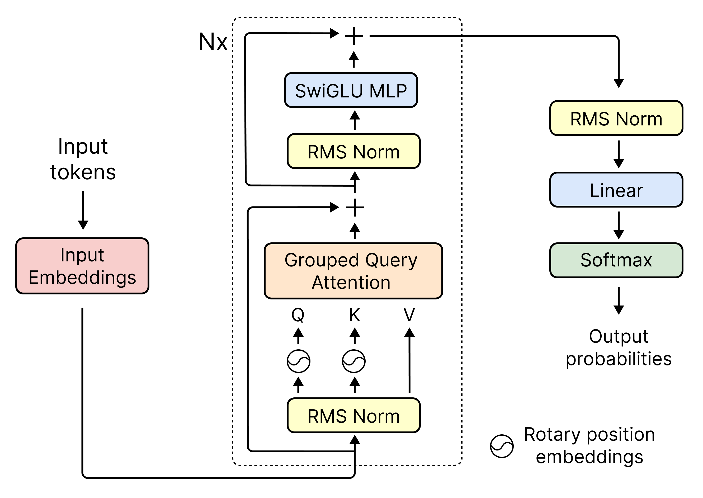

# llama3 🦙🔶

<p align='center'>
    
</p>

## About

llama3 is a custom implementation of [Meta's Llama 3](https://www.llama.com/), developed internally at Tanaos. At Tanaos we 🧡 Llama and we rely on it for many of our products. That's why we decided to re-implement it internally, from scratch, in Pytorch. The result is an efficient and completely customizable model, fully compatible with [Hugging Face's Llama-3-8B weights](https://huggingface.co/meta-llama/Meta-Llama-3-8B).

## How it works

This repository implements a standard Llama3 architecture (as described in the diagram below), with no significant departures from it. It was designed to be both readable and easily customizable, while being fully compatible with the [Llama-3-8B weights](https://huggingface.co/meta-llama/Meta-Llama-3-8B) from Hugging Face.

<p align='center'>
    
</p>

## Installation

Simply install the project dependencies by running

```
pip install -r requirements.txt
```

from the project root.

## How to use it

llama3 can be used in one of two ways: by loading a pre-trained checkpoint, or *as-is* (untrained).

### Load a pre-trained checkpoint

Load a pre-trained [Hugging Face's Llama-3-8B checkpoint](https://huggingface.co/meta-llama/Meta-Llama-3-8B) with
`Transformer.from_pretrained()` then perform inference or fine-tune it; 

> ⚠️ **Warning**: you are going to need a GPU with at least 28GB of RAM to load the model in full `torch_dtype=torch.float32` precision.

1. Create a `.env` file in the project root and add your Hugging Face access token to it, like so

    ```bash
    HF_TOKEN=<your_huggingface_token>
    ```

    if you don't have a Hugging Face access token, you can [get one here](https://huggingface.co/settings/tokens)

2. Load the pre-trained model from Hugging Face

    ```python
    from models.transformer.transformer import Transformer

    model = Transformer.from_pretrained()
    ```

3. Encode tokens with a Llama3 tokenizer

    ```python
    import torch
    from transformers import AutoTokenizer

    tokenizer = AutoTokenizer.from_pretrained("meta-llama/Meta-Llama-3-8B-Instruct")
    initial_sentence = "Hello, I'm a language model,"
    initial_tokens = torch.tensor([tokenizer.encode(initial_sentence)])
    ```

4. Perform inference with `Transformer.generate()`

    ```python
    out_tokens = model.generate(idx=initial_tokens, max_new_tokens=18)
    print(tokenizer.batch_decode(out_tokens))
    ```

    output:

    ```python
    >>> ["<|begin_of_text|>Hello, I'm a language model, and I'm here to help you with any questions. comments, or just to chat."]
    ```

5. (optionally) fine-tune the model by implementing a custom training loop

### Use it *as-is*

Load an untrained model with randomly initialized weights, then train it by implementing a custom training loop:

1. Instantiate a `Transformer` object by passing an instance of `ModelConfig` to it.

    ```python
    from models.transformer.transformer import Transformer, ModelConfig


    config = ModelConfig()
    m = Transformer(config)
    ```

    the default values of `ModelConfig` are those used by Llama-3-8B:

    ```python
    class ModelConfig:
        d_model: int = 4096
        dim_kv: int = 1024
        num_q_heads: int = 32
        num_kv_heads: int = 8
        dim_ff: int = 14336
        vocab_size: int = 128256
        n_layer: int = 32
        norm_eps: int = 1e-05
        rope_theta: float = 500000.0
    ```

2. Encode tokens with a Llama3 tokenizer

    ```python
    import torch
    from transformers import AutoTokenizer

    tokenizer = AutoTokenizer.from_pretrained("meta-llama/Meta-Llama-3-8B-Instruct")
    initial_sentence = "Hello, I'm a language model,"
    initial_tokens = torch.tensor([tokenizer.encode(initial_sentence)])
    ```
3. Perform inference with `Transformer.generate()`

    ```python
    out_tokens = model.generate(idx=initial_tokens, max_new_tokens=20)
    print(tokenizer.batch_decode(out_tokens))
    ```

4. Implement a custom training loop to train the model's parameters

## Contributors wanted! 🤝

We are looking for contributors! Want to help us developing this awesome project? Get started by taking a look at [CONTRIBUTING.md](./CONTRIBUTING.md)